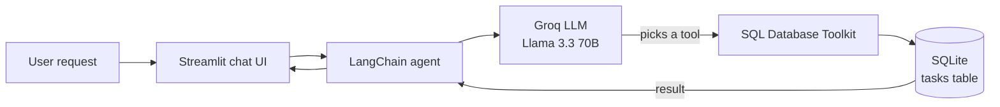

# 🗂️ AI SQL Task Management Agent

Manage a to-do list in plain English. The AI agent turns your request into SQL, runs it on a real database, and shows the result.

🔗 **Live demo:** [[sql-task-agent.streamlit.app](https://sql-task-agent.streamlit.app)](https://sql-task-agent.streamlit.app/)


## ✨ What it does

Type a request like you would to a person, and the agent handles the database for you:

| You type | What the agent does |
|---|---|
| `Create a task called Learn SQL` | Writes and runs an `INSERT` query |
| `Show all tasks` | Runs a `SELECT` and returns a table |
| `Mark task 3 as completed` | Runs an `UPDATE`, then confirms with a `SELECT` |
| `Delete task 2` | Runs a `DELETE`, then confirms with a `SELECT` |

## 🛠️ Tech stack

Python · LangChain · LangGraph · Groq (`llama-3.3-70b-versatile`) · SQLite · Streamlit

## 🧠 How it works



The agent is built from four parts:

| Part | Role |
|---|---|
| **LLM** (Groq, Llama 3.3 70B) | Understands the request and decides which SQL to run |
| **Tools** (`SQLDatabaseToolkit`) | Let the agent inspect the schema and run queries |
| **Memory** (`InMemorySaver`) | Remembers the conversation, with one thread per visitor |
| **System prompt** | Sets the rules: max 10 rows, newest first, confirm every change |

## 🗄️ Database schema

```sql
CREATE TABLE IF NOT EXISTS tasks(
    id INTEGER PRIMARY KEY AUTOINCREMENT,
    title TEXT NOT NULL,
    description TEXT,
    status TEXT CHECK (status IN ('pending','in_progress','completed')) DEFAULT 'pending',
    created_at TIMESTAMP DEFAULT CURRENT_TIMESTAMP
);
```

The `CHECK` constraint means the database itself rejects any invalid status, even if the LLM makes a mistake.

## 🔧 Problems I solved while deploying

| Problem | Cause | Fix |
|---|---|---|
| Visitors could see each other's chats | Every user shared one memory thread (`thread_id = "1"`) | Gave each visitor their own `uuid` thread in `st.session_state` |
| Creating tasks failed with `output_parse_failed` | The reasoning model broke its output on longer tool calls such as `INSERT` | Tested a larger model and a higher token limit, then switched to Llama 3.3 70B, which calls tools reliably |
| A failed request crashed the whole page | No error handling around the agent call | Wrapped the call in `try/except`: users see a friendly message, and the real error goes to the server logs |

## 📁 Project structure

```text
AI-SQL-Task-Management-Agent/
├── SQL_Task_Agent.py    # Streamlit app + agent
├── data/
│   └── sql_prompt.txt
├── assets/
│   └── screenshot.png
├── requirements.txt
├── .gitignore           # keeps .env and my_tasks.db out of GitHub
└── README.md
```

## 🚀 Run locally

```bash
git clone https://github.com/itsnidhimehta/AI-SQL-Task-Management-Agent.git
cd AI-SQL-Task-Management-Agent

python -m venv env
env\Scripts\activate            # Mac/Linux: source env/bin/activate
pip install -r requirements.txt
```

Create a `.env` file with your free Groq key from [console.groq.com](https://console.groq.com):

```text
GROQ_API_KEY=your_groq_api_key
```

Then run:

```bash
streamlit run SQL_Task_Agent.py
```

The SQLite database `my_tasks.db` is created automatically on first run.

## ⚠️ Known limitations

- The live demo uses one shared SQLite database, so all visitors see the same tasks, and the data resets when the app restarts.
- The agent can run any SQL the LLM writes, including a `DELETE` without a filter.

## 🔮 Next improvements

- PostgreSQL with a `user_id` on every task, so each user only sees their own tasks
- Replace the general SQL tools with specific tools (`add_task`, `update_status`, …) so the agent cannot run unsafe queries
- Unit tests with a fake LLM, and a GitHub Actions workflow to run them on every push

## 👩‍💻 Author

**Nidhi Mehta** · [GitHub](https://github.com/itsnidhimehta) · [LinkedIn](https://linkedin.com/in/nidhi-mehta14)
